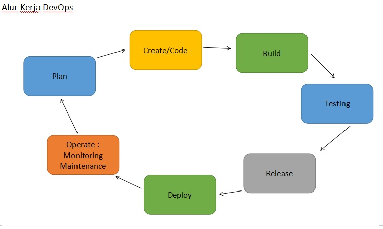
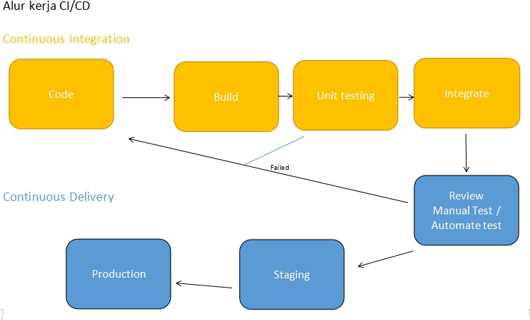

# Test Technical Online Bootcamp DumbWays.id DEVOPS ENGINEER
1. OS yang digunakan: Window 10
2. Sumber artikel
   - https://www.redhat.com/en/topics/devops/what-is-ci-cd (no.2)
   - https://vegibit.com/creating-databases-and-tables-in-mysql/ (no.3)
   - https://phoenixnap.com/kb/grep-command-linux-unix-examples (no. 4)
   - https://hibbard.eu/install-ubuntu-virtual-box/ (no.5)
   - https://silicophilic.com/virtualbox-running-slow/ (no.5)

**Jawaban soal test DevOps Engineer Dumbways**
1. DevOps adalah budaya kolaborasi antara developer dan operation yang melahirkan serangkaian praktik yang mempercepat proses development dan operasi secara otomatis, kontinyu dan terintegrasi.

2. CI/CD adalah metode delivery apps, dimana CI adalah dimana source code developer dilakukan build, unit test dan integrasi, CD adalah continuous delivery dan continuous deployment artinya code yang telah terintegrasi otomatis masuk ke repository dan deploy ke production environment

3. blum dikerjakan

4. Grep singkatan dari Global Regular Expression Print, adalah command-line tool yang digunakan untuk mencari string dalam sebuah file, keyword yang cocok akan ditampilkan. Perintah grep berguna saat mencari string atau kata dalam sebuah log file.\
Contoh:
  `grep -i 'error' test/file1`
  hasil `error`
  `error.text`
  `error.data` 
    - 'error' adalah string atau kata yang akan dicari
    - test adalah lokasi foldernya
    - file1 adalah filenya yang akan dicari kata 'error' di dalamnya, hasilnya menampilkan semua yang mengandung kata error

5. 
