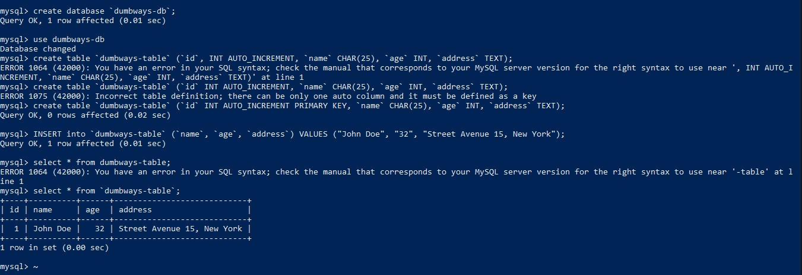
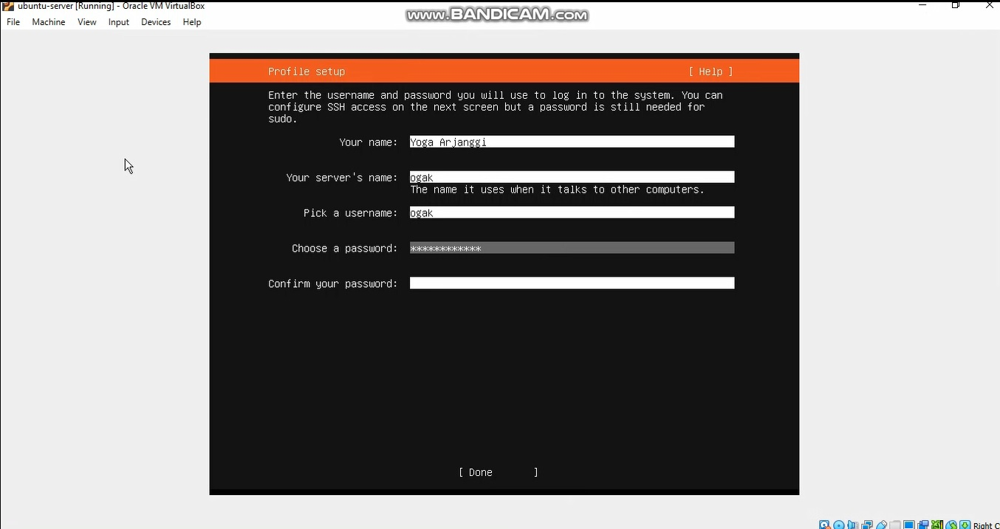

# Test Technical Online Bootcamp DumbWays.id DEVOPS ENGINEER
1. OS yang digunakan: Windows 10
2. Sumber artikel
   - https://www.redhat.com/en/topics/devops/what-is-ci-cd (no.2)
   - https://nasabahmedia.com/ci-cd/ (no.2)
   - https://vegibit.com/creating-databases-and-tables-in-mysql/ (no.3)
   - https://phoenixnap.com/kb/grep-command-linux-unix-examples (no. 4)
   - https://hibbard.eu/install-ubuntu-virtual-box/ (no.5)
   - https://silicophilic.com/virtualbox-running-slow/ (no.5)

**Jawaban soal test technical DevOps Engineer Dumbways**
1. DevOps adalah budaya kolaborasi antara developer dan operation yang melahirkan serangkaian praktik yang mempercepat proses development dan operasi secara otomatis, kontinyu dan terintegrasi.

2. CI/CD adalah metode delivery apps\
   CI (Continuous Integration) adalah source code developer yang telah di push ke repository kemudian secara otomatis akan di build dan di test    
   CD yaitu
   - Continuous delivery, code yang telah terintegrasi dan sudah ready namun belum di deploy ke dalam production environtment
   - Continuous deployment, fase akhir CI/CD dimana apps di build ke production environtment.

 

3. Video rekaman bisa dilihat di folder _video-rekaman/03.mkv_ 
   (https://www.youtube.com/watch?v=fFUP9tv-oZI)
 
  

4. Grep singkatan dari Global Regular Expression Print, adalah command-line tool yang digunakan untuk mencari string dalam sebuah file, keyword yang cocok akan ditampilkan. Perintah grep berguna saat mencari string atau kata dalam sebuah log file.\
Contoh:
  `grep -i 'error' test/file1`
  hasil `error`
  `error.text`
  `error.data` 
    - 'error' adalah string atau kata yang akan dicari
    - test adalah lokasi foldernya
    - file1 adalah file yang akan dicari kata 'error' di dalamnya
    - hasilnya menampilkan semua yang mengandung kata 'error'
    
   

5. - Install kemudian buka/launch VirtualBox
   - Klik Machine -> New
   - Beri nama pada virtual machine dan pilih OS yang digunakan, misal type: linux, version: ubuntu (64-bit), Next
   - Pilih ukuran memory misal 3096 Mb, klik Next
   - Pada pilihan Hard disk pilih Create virtual hardisk now, Next
   - Berikutnya Pilih type Hard disk misal VDI (VirtualBox Disk Image), Next
   - Pilih Storage on physical hard disk misal dynamically allocated
   - File location and size pilih 10 Gb, Klik Create
   - Kemudian lakukan konfigurasi sesuai kebutuhan melalui Settings
   - Selanjutnya memasukkan live cd ubuntu-server yang telah di download
   - Klik settings -> Storage -> Controller IDE klik empty -> Klik icon virtual optic disk -> pilih lokasi tempat penyimpanan ubuntu-server
   - Klik start untuk memulai virtual machine
   - Selanjutnya installasi OS ubuntu pada virtual machine 
   - Lakukan proses install sesuai kebutuhan seperti masukkan nama, nama server, username, dan password.
   - Kemudian tunggu proses installasi selesai
   - Login ke server menggunakan username dan password dari proses install tadi
   - Selesai, virtual machine dapat digunakan.

   Video rekaman bisa dilihat di folder _video-rekaman/05.mkv_
   
(http://www.youtube.com/watch?v=TW9N3elJ4ks)
